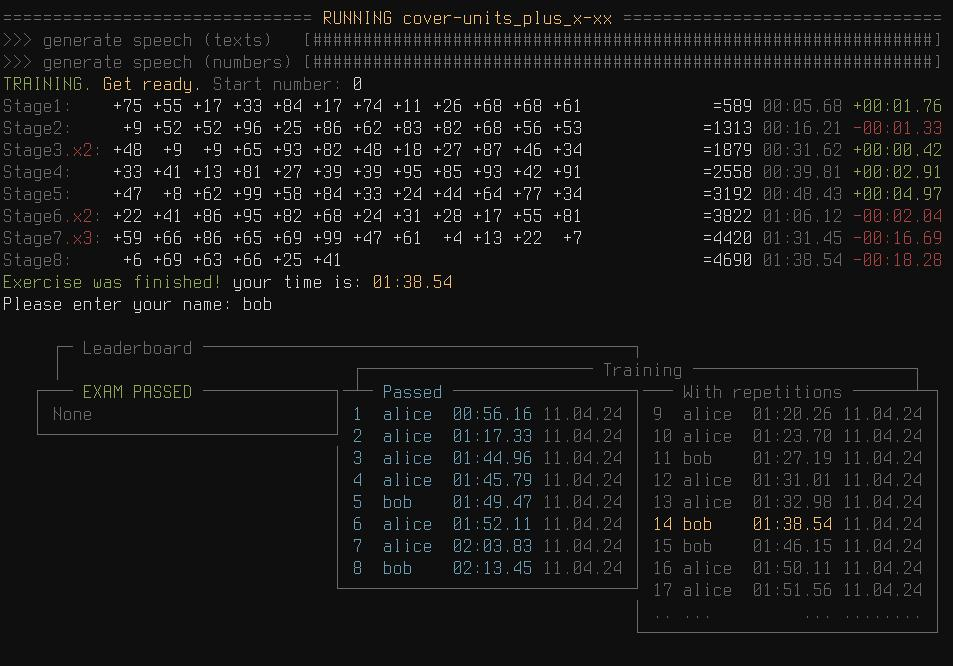

# Soroban Exercise Management System

### Intro
What is Soroban and Its Benefits:
```
Soroban is a traditional Japanese abacus used for arithmetic calculations.
It helps develop mental abilities, attention, and calculation speed.
Demonstrations:
  https://www.youtube.com/watch?v=F-THPY14fzc
  https://www.youtube.com/watch?v=uKCb-ek9Vs8
```
Resources for Learning Soroban:
```
Basics of Soroban:
  Playlist for Beginners:
    https://www.youtube.com/playlist?list=PLLByEhnwMI5lhKse9FjEMNj_KzF5-W5BI
  Books:
    - Japanese Abacus Use & Theory
    - Advanced Abacus: Theory and Practice
  Additional Resources:
    - Soroban Exam: https://www.sorobanexam.org/
```
Cheat Sheet for Finger Techniques: [./imgs/cheat-sheetjpg](./imgs/cheat-sheet.jpg)
```
Symbols:
  table 1:
    Y-axis  - Initial value in the digit.
    X-axis  - Operation on the digit.
  table 2:
    regular arrow      - index finger
    arrow with circle  - thumb
    1  - one or more single bone
    5  - heaven bone (5ths)
    x  - a one single bone from the senior numerical category (10ths)
    ex - column with example numbers given in the book Japanese Abacus Use & Theory,
         so you can always go there for explanations
         NOTE: sometimes in this book the combinations overlap in several examples
         NOTE: "x" means that there was no example given for this group
How to use:
  always perform movements from left to right.
  movements arranged horizontally:
    - both movements must be performed simultaneously,
      mentally implying that the one from above is the first movement
    - if you do not have enough experience to perform movements at the same time,
      first do the one from above
```

### Installation Guide
```bash
# Create a Python virtual environment (venv).
python -m venv venv
source venv/bin/activate
# Install python dependencies:
pip install -r requirements.txt
# Install the console player mpv:
sudo apt-get install mpv
```

### Usage
###### Main commands:
```
./main.py [-h] {create,analyze,run,run-new} ...
    create              Create a new exercise.
    analyze             Analyze an exercise.
    run                 Run an existing exercise.
    run-new             Create, analyze and run a new exercise.
```
###### Creating an Exercise (`create`):
```
./main.py create [-h] {random,cover-units,arithmetic} ...
                        Type for creating exercise.
    random              Random type for creating exercise.
    arithmetic          Arithmetic type for creating exercise.
    cover-units         An exercise with all possible combinations of the number of units.
```
###### Analyzing an Exercise (`analyze`: [./imgs/screen-analyze.jpg](./imgs/screen-analyze.jpg)):
```
./main.py analyze [-h] name
    name                Name of the exercise to analyze.
```
NOTE: that arithmetic progression does not guarantee full coverage of all possible combinations.
```
================================== ANALYZE arithmetic_0-100 ==================================
Lenght sequence:  101
Calculated total: 5050
Provided total:   5050
OK: The calculated total matches the provided total.

                                      COMBINATION DENSITY

       ┌─────[ Units ]─────┐          ┌─────[ Tens ]──────┐          ┌────[ Hundreds ]───┐
   ┌───┴─[ - ]─┬───┬─[ + ]─┴───┐  ┌───┴─[ - ]─┬───┬─[ + ]─┴───┐  ┌───┴─[ - ]─┬───┬─[ + ]─┴───┐
   │           │ 9 │           │  │           │ 9 │ xx2xxx  x │  │           │ 9 │ x         │
   │           │ 8 │   5    5  │  │           │ 8 │    2xx2xx │  │           │ 8 │           │
   │           │ 7 │           │  │           │ 7 │ 22 x22xx2 │  │           │ 7 │           │
   │           │ 6 │  5 5  5 5 │  │           │ 6 │ x 3x   x2 │  │           │ 6 │           │
   │           │ 5 │ 5   55    │  │           │ 5 │ 22  xx2x3 │  │           │ 5 │           │
   │           │ 4 │           │  │           │ 4 │ x xxx2 2  │  │           │ 4 │           │
   │           │ 3 │   5    5  │  │           │ 3 │ xx2xxx    │  │           │ 3 │           │
   │           │ 2 │           │  │           │ 2 │ xxx22 22  │  │           │ 2 │           │
   │           │ 1 │  5 5  5 5 │  │           │ 1 │  x  x2xx  │  │           │ 1 │           │
   │           │ 0 │ 5   55    │  │           │ 0 │ x2xx  2xx │  │           │ 0 │           │
   ├───────────┼───┼───────────┤  ├───────────┼───┼───────────┤  ├───────────┼───┼───────────┤
   └─987654321─┘   └─123456789─┘  └─987654321─┘   └─123456789─┘  └─987654321─┘   └─123456789─┘

                                      ┌─────[ TOTAL ]─────┐
                                  ┌───┴─[ - ]─┬───┬─[ + ]─┴───┐
                                  │           │ 9 │ 2x2xxx  x │
                                  │           │ 8 │   52xx26x │
                                  │           │ 7 │ 22 x22xx2 │
                                  │           │ 6 │ x536  5x7 │
                                  │           │ 5 │ 72  662x3 │
                                  │           │ 4 │ x xxx2 2  │
                                  │           │ 3 │ xx7xxx 5  │
                                  │           │ 2 │ xxx22 22  │
                                  │           │ 1 │  6 5x26x5 │
                                  │           │ 0 │ 62xx552xx │
                                  ├───────────┼───┼───────────┤
                                  └─987654321─┘   └─123456789─┘
```
###### Run an existing exercise (`run`):
```
./main.py run [-h] name
    name                Name of the exercise to run.
```
```
NOTE: An internet connection is required to generate uncached sounds.
      Ensure your system is connected to the internet before attempting to play these exercises.
```
###### Create, analyze and run a new exercise (`run-new`):
```
./main.py run-new [-h] {random,cover-units,arithmetic} ...
                        Type for creating exercise.
    random              Random type for creating exercise.
    cover-units         An exercise with all possible combinations of the number of units.
    arithmetic          Arithmetic type for creating exercise.
```
```
NOTE: An internet connection is required to generate uncached sounds.
      Ensure your system is connected to the internet before attempting to play these exercises.
```

### Related topics:
- Chisanbop (finger counting method): https://youtu.be/RSHDTsDebpY
```
NOTE: Suitable for up to four-digit numbers, pairs well with Soroban for up to two-digit numbers.
```
- Multiplication Table on Fingers (6-10): https://youtu.be/T_LjhJKuFKw
- Memory techniques: Memory palace, Major system, Dominis system, etc..
