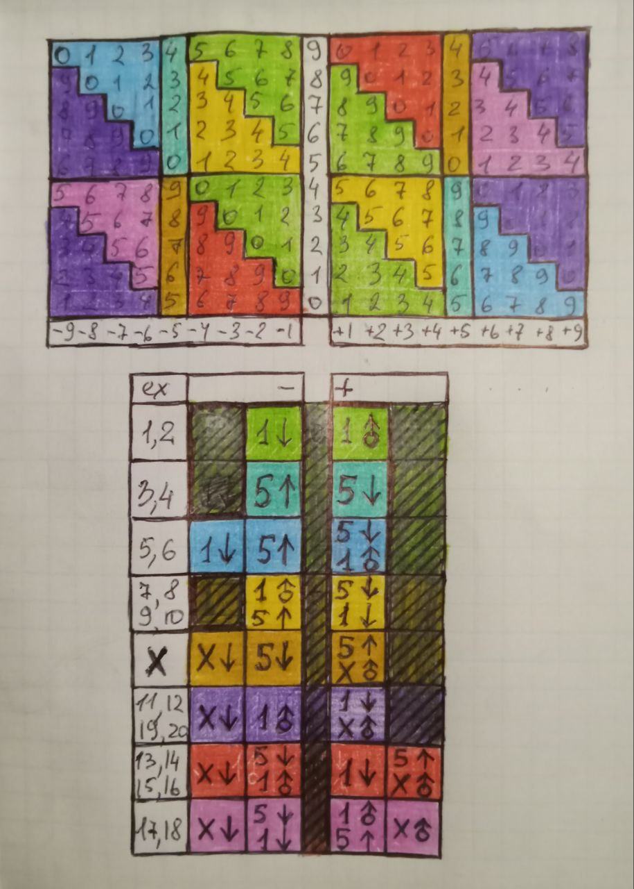

Soroban Exercise Management System

1. What is Soroban and Its Benefits
   Soroban is a traditional Japanese abacus used for arithmetic calculations.
   It helps develop mental abilities, attention, and calculation speed.

2. Resources for Learning Soroban
   Skill Demonstrations:
   - Video 1: https://www.youtube.com/watch?v=F-THPY14fzc
   - Video 2: https://www.youtube.com/watch?v=uKCb-ek9Vs8

   Basics of Soroban:
   - Playlist for Beginners: https://www.youtube.com/playlist?list=PLLByEhnwMI5lhKse9FjEMNj_KzF5-W5BI
   - Books:
     - Japanese Abacus Use & Theory
     - Advanced Abacus: Theory and Practice

   Additional Resources:
   - Soroban Exam: https://www.sorobanexam.org/

   Cheat Sheet for Finger Techniques:
   - Image: 
     Y-axis: Initial value in the digit.
     X-axis: Operation on the digit.
     Symbols: regular arrow (index finger), arrow with circle (thumb), 1 (one or more single beads), 5 (heaven bead).

   How to Use the Cheat Sheet:
   - Perform movements from left to right.
   - If it's difficult to perform movements simultaneously, start with the top one.

3. Installation and Setup
   Required Installations:
   - Create a Python virtual environment (venv).
   - Use the dependency file requirements.txt.
   - Install the console player mpv.
   Warning:
   - An internet connection is required to work with uncached audio files.

4. Using the Program
   System Commands:
   - Creating an Exercise (`create`):
     - `arithmetic` — arithmetic progression.
     - `random` — random sequence.
     - `cover-units` — tasks covering all combinations of numbers.
   - Analyzing an Exercise (`analyze`):
     Allows analyzing a created exercise.
     Note that arithmetic progression does not guarantee full coverage of all possible combinations.
   - Running an Exercise (`run`, `run-new`):
     - `run` — run an existing exercise.
     - `run-new` — create and run a new exercise.

5. Additional Resources and Methods
   Multiplication Table on Fingers (6-10):
   - Video Tutorial: https://youtu.be/T_LjhJKuFKw
   Chisanbop (finger counting method):
   - Training Video: https://youtu.be/RSHDTsDebpY
   - Note: Suitable for up to four-digit numbers, pairs well with Soroban for up to two-digit numbers.
