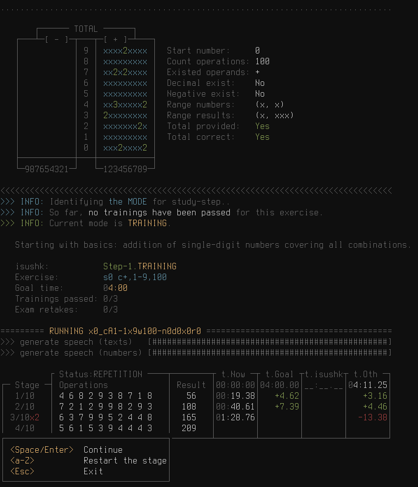

# Soroban Exercise Management System

## Content
- [Intro](#Intro)
- [Installation](#Installation)
- [Usage](#Usage)
   - [Main commands](#Main-commands)
   - [Creating an Exercise](#Creating-an-Exercise)
   - [Analyzing an Exercise](#Analyzing-an-Exercise)
   - [Run an existing exercise](#Run-an-existing-exercise)
   - [Create, analyze and run a new exercise](#Create-analyze-and-run-a-new-exercise)
- [Related topics](#Related-topics)

## Intro
### What is Soroban and Its Benefits
Soroban is a traditional Japanese abacus used for arithmetic calculations.<br>
It helps develop mental calculation speed.<br>
Demonstrations:
  - https://www.youtube.com/watch?v=F-THPY14fzc
  - https://www.youtube.com/watch?v=uKCb-ek9Vs8

### Resources for Learning Soroban
- Playlist for Beginners:
  - https://www.youtube.com/playlist?list=PLLByEhnwMI5lhKse9FjEMNj_KzF5-W5BI
- Books:
  - [Japanese Abacus Use & Theory](./theory/1_Abacus-Japanese-Its-Use-And-Theory.pdf)
  - [Advanced Abacus: Theory and Practice](./theory/2_Advanced-Abacus-Theory-and-Practice.pdf)
- Additional Resources:
  - https://www.sorobanexam.org/

### Cheat Sheet for Finger Techniques: [cheat-sheet.jpg](./imgs/cheat-sheet.jpg)
```
Symbols:
  table 1:
    Y-axis  - Initial value in the digit.
    X-axis  - Operation on the digit.
  table 2:
    regular arrow      - index finger
    arrow with circle  - thumb
    1  - one or more single bone
    5  - heaven bone (5ths)
    x  - a one single bone from the senior numerical category (10ths)
    ex - column with example numbers given in the book Japanese Abacus Use & Theory,
         so you can always go there for explanations
         NOTE: sometimes in this book the combinations overlap in several examples
         NOTE: "x" means that there was no example given for this group
How to use:
  always perform movements from left to right.
  for movements that are recorded horizontally:
    - both movements must be performed simultaneously,
      mentally implying that the one from above is the first movement
    - if you do not have enough experience to perform movements at the same time,
      first do the one from above
```

## Installation
You can install it automatically:
```bash
./install.sh
```
or you can install it manually (recomended):
```bash
# Create a Python virtual environment (venv).
python -m venv venv
source venv/bin/activate
# Install python dependencies:
pip install -r requirements.txt
# Install the console player mpv:
sudo apt-get install mpv
# create and configure the config to suit your needs:
cp ./examples/config.yml ./config.yml
```

## Usage
Activate the virtual environment before using it:
```bash
source venv/bin/activate
```
### Main commands
```bash
usage: soroban.py [-h] {create,analyze,run,run-new,study} ...

Soroban exercise management system.

positional arguments:
  {create,analyze,run,run-new,study}
                        Command to perform.
    create              Create a new exercise.
    analyze             Analyze an exercise.
    run                 Run an existing exercise.
    run-new             Create, analyze and run a new exercise.
    study               A collection of exercises with pre-defined modes (training and exam) and time to successfully complete further.

options:
  -h, --help            show this help message and exit
```
### Study (recomended)
The easiest and most effective way to use the application for the end user:
```bash
usage: soroban.py study [-h] [--user USER]

options:
  -h, --help   show this help message and exit
  --user USER  User-name to save and track records
```
### Creating an Exercise
```bash
usage: soroban.py create [-h] [--path PATH] params

positional arguments:
  params       params = "<start-number> <sequence> <sequence> ..."

                 defines the characteristics of the expression.
                 at least <start-number> and one <sequence> must be specified.

                 <start-number>:
                   initial number in the format "sX", where X is any number (including negative and decimal fractions),
                   or "r" - generate randomly from <range> and <decimal> from the first <sequence>.

                 <sequence> = "<kind><seq_params>":
                   <kind>:
                     defines the "type" of sequence:
                       "a" - An arithmetic progression.
                       "r" - Generate numbers randomly.
                       "c" - Covering all possible combinations of the category of units.
                   <seq_params>:
                     parameters for <seq_params> consist of two sections: required arguments and optional.
                     if optional arguments are specified - they are separated by a colon:

                       <seq_params> = "<required>:<optional>"

                     for <kind> = "a":
                       the first number of the progression will be the result of the left part of the expression.
                       <required>:
                         required parameters, separated by commas, specified in strict order:

                           <required> = "<diff>,<length>"

                         <diff>
                           The difference between the numbers.
                           any number (including negative and decimal fractions), by default - none.
                         <length>
                           The length of the progression.
                           any natural number, by default - none.

                       <optional>:
                         optional parameters:

                           <optional> = ":<roundtrip>"

                         <roundtrip> = "<" (default disabled):
                           add a copy of the inverted version of the resulting expression to the end:
                             - mirror the sequence of numbers
                             - convert + to -, * to / and vice versa

                     for <kind> = "r" or "c":
                       <required>:
                         required parameters (except <length> for <kind>="c"), separated by commas,
                         specified in strict order:

                           <required> = "<operands>,<range>,<length>"

                         <operands>:
                           which operands to use. options: "+", "-", "*", "/".
                           if multiple operands are specified, they will be selected randomly for each new number.
                           after each operand, you can specify priority (any natural number - default "1").
                         <range>:
                           Range for generating numbers in the format "x-y", where "x" and "y" are any natural numbers.
                           Decimal precision will be automatically considered.
                           Cannot be negative - this effect is achieved through operands and their priorities.
                         <length> (optional for kind=cover)
                           the length of the sequence, where <length> is any natural number.
                           for kind=cover it is optional, once all combinations are covered - generate numbers randomly.

                       <optional>:
                         optional parameters, not separated by each other, specified in random order:

                           <optional> = ":<allow-negative><decimal><roundtrip>"

                         <allow-negative> = "n" (default disabled):
                           if start-number >= 0 allow going into negative.
                           if start-number < 0 allow going below the initial start-number.
                         <decimal> = ".x%y" (default disabled):
                           randomly add decimal fractions with precision up to "x" decimal places,
                           where "x" is any natural number. by default - none.
                           you can specify the probability in percent at the end with "%y",
                           where "y" is a natural number from 0 to 100 (default %50).
                         <roundtrip> = "<" (default disabled):
                           add a copy of the inverted version of the resulting expression to the end:
                             - mirror the sequence of numbers
                             - convert + to -, * to / and vice versa

               examples of use:
                   ...

options:
  -h, --help   show this help message and exit
  --path PATH  Set the custom full file name of the created exercise (by default ./data/*.txt).
```
### Analyzing an Exercise
Example: [./imgs/screen-analyze.jpg](./imgs/screen-analyze.jpg)
```bash
usage: soroban.py analyze [-h] path

positional arguments:
  path        Path to file.

options:
  -h, --help  show this help message and exit
```
NOTE: Training on arithmetic progression may not be the most effective way:
- It is advisable to use changing sequences to avoid memorization, instead of calculations
- An arithmetic progression starting with an initial number of 0 does not effectively cover all possible combinations:
  - The category of units is a cycle of 20 unique combinations (about 20-25 numbers long).
  - The category of tens is a cycle of 98 unique combinations (about 780 numbers long).
  - A progression of about 800 numbers finally covers all options.
```
================================== ANALYZE arithmetic_0-100 ==================================
Lenght sequence:  101
Calculated total: 5050
Provided total:   5050
OK: The calculated total matches the provided total.

                                      COMBINATION DENSITY

       ┌─────[ Units ]─────┐          ┌─────[ Tens ]──────┐          ┌────[ Hundreds ]───┐
   ┌───┴─[ - ]─┬───┬─[ + ]─┴───┐  ┌───┴─[ - ]─┬───┬─[ + ]─┴───┐  ┌───┴─[ - ]─┬───┬─[ + ]─┴───┐
   │           │ 9 │           │  │           │ 9 │ xx2xxx  x │  │           │ 9 │ x         │
   │           │ 8 │   5    5  │  │           │ 8 │    2xx2xx │  │           │ 8 │           │
   │           │ 7 │           │  │           │ 7 │ 22 x22xx2 │  │           │ 7 │           │
   │           │ 6 │  5 5  5 5 │  │           │ 6 │ x 3x   x2 │  │           │ 6 │           │
   │           │ 5 │ 5   55    │  │           │ 5 │ 22  xx2x3 │  │           │ 5 │           │
   │           │ 4 │           │  │           │ 4 │ x xxx2 2  │  │           │ 4 │           │
   │           │ 3 │   5    5  │  │           │ 3 │ xx2xxx    │  │           │ 3 │           │
   │           │ 2 │           │  │           │ 2 │ xxx22 22  │  │           │ 2 │           │
   │           │ 1 │  5 5  5 5 │  │           │ 1 │  x  x2xx  │  │           │ 1 │           │
   │           │ 0 │ 5   55    │  │           │ 0 │ x2xx  2xx │  │           │ 0 │           │
   ├───────────┼───┼───────────┤  ├───────────┼───┼───────────┤  ├───────────┼───┼───────────┤
   └─987654321─┘   └─123456789─┘  └─987654321─┘   └─123456789─┘  └─987654321─┘   └─123456789─┘

                                      ┌─────[ TOTAL ]─────┐
                                  ┌───┴─[ - ]─┬───┬─[ + ]─┴───┐
                                  │           │ 9 │ 2x2xxx  x │
                                  │           │ 8 │   52xx26x │
                                  │           │ 7 │ 22 x22xx2 │
                                  │           │ 6 │ x536  5x7 │
                                  │           │ 5 │ 72  662x3 │
                                  │           │ 4 │ x xxx2 2  │
                                  │           │ 3 │ xx7xxx 5  │
                                  │           │ 2 │ xxx22 22  │
                                  │           │ 1 │  6 5x26x5 │
                                  │           │ 0 │ 62xx552xx │
                                  ├───────────┼───┼───────────┤
                                  └─987654321─┘   └─123456789─┘
```
### Run an existing exercise
```bash
# NOTE: An internet connection is required to generate uncached sounds.
#       Ensure your system is connected to the internet before attempting to play these exercises.
usage: soroban.py run [-h] path {abacus,mental} {training,exam} ...

positional arguments:
  path             Path to file.
  {abacus,mental}  Calculate using an abacus or mentally.
  {training,exam}
    training       A training session.
    exam           An exercise.

options:
  -h, --help       show this help message and exit
```
### Create, analyze and run a new exercise
```bash
# NOTE: An internet connection is required to generate uncached sounds.
#       Ensure your system is connected to the internet before attempting to play these exercises.
usage: soroban.py run-new [-h] {abacus,mental} {training,exam} ...

positional arguments:
  {abacus,mental}  Calculate using an abacus or mentally.
  {training,exam}
    training       A training session.
    exam           Pass the exam.

options:
  -h, --help       show this help message and exit
```
<br/>
<br/>

## Related topics
- Chisanbop (finger counting method): https://youtu.be/RSHDTsDebpY
```
NOTE: Suitable for up to four-digit numbers.
      Pairs well with Soroban for up to two-digit numbers.
```
- Multiplication Table on Fingers (6-10): https://youtu.be/T_LjhJKuFKw
- Memorization techniques:
    - Memory palace: https://youtu.be/E1x9IaMTpyw
    - Major system: https://www.youtube.com/watch?v=nJGMXUJCB-4&t=20s
    - Dominic system (PAO system):
        - https://youtu.be/R-gCm3gEFQE
        - https://youtu.be/ogtVQ48VgC4
- Anki: https://ankiweb.net
